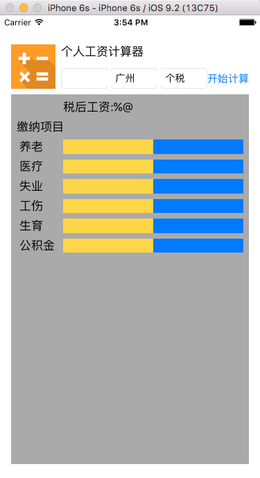

1. 创建UI界面和添加约束
	* UI设计
	* 让三个输入框均匀分布在中间

	基本的原理是: a,b,c三个控件, 首先约束a的top和leading到父view; 然后约束b的top跟a一致, b的垂直位置和a的一致, b的宽度和a的一致, b与a的leading设置一个值. c和b类似, 各项约束到b即可.
	 
    
2. 创建一个自定义的视图
    * 从UIView派生自定义视图需要overide的一些方法
   
	```
	public override init(frame: CGRect) {
		super.init(frame: frame)
		self.setupSubviews()
	}
	public convenience init() {
		self.init(frame: CGRect.zero)
	}
	
	required public init?(coder aDecoder: NSCoder) {
		super.init(coder: aDecoder)
		setupSubviews()
	}
	func setupSubviews() {
	// ...
	}
	```
	
	* 在构造函数初始化子view, 在setupSubviews重新布局它们的位置
